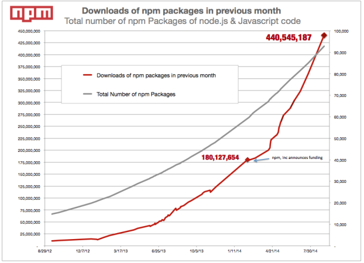

### About me

* Full time node.js dev at Digbil
* Web dev for the past 2.5 years (front end and back end)


# Node.js: What's that?


# Server side javascript


# In details

* V8 javascript engine
* Node.js API replaces the DOM & browser API
* An event loop


## V8 engine

* Controlled javascript env (es5)
* Some es6 features present in `0.11` (use `--harmony`)


## Node.js API
* Core api to access the file system, the network (http, sockets), crypto functions...
* No DOM
* More about the core api later


## Event loop
* Same as in the browsers.
* Event driven system
* New functions `setImmediate` and `process.nextTick`
* Fundamental concept in node.js (watch: [What the heck is the event loop anyway](https://www.youtube.com/watch?v=8aGhZQkoFbQ) )


# Package.json and module system


# Package.json

```javascript
{
  "name": "reveal.js",
  "version": "2.6.2",
  "description": "The HTML Presentation Framework",
  "homepage": "http://lab.hakim.se/reveal-js",
  "subdomain": "revealjs",
  "scripts": {
    "test": "grunt test",
    "start": ""
  },
  "author": {
    "name": "Hakim El Hattab",
    "email": "hakim.elhattab@gmail.com",
    "web": "http://hakim.se"
  },
  "repository": {
    "type": "git",
    "url": "git://github.com/hakimel/reveal.js.git"
  },
  "engines": {
    "node": "~0.8.0"
  },
  "dependencies": {
    "underscore": "~1.5.1",
    "express": "~2.5.9",
    "mustache": "~0.7.2",
    "socket.io": "~0.9.13"
  },
  "devDependencies": {
    "grunt-contrib-qunit": "~0.2.2",
    "grunt-contrib-jshint": "~0.6.4",
    "grunt-contrib-cssmin": "~0.4.1",
    "grunt-contrib-uglify": "~0.2.4",
    "grunt-contrib-watch": "~0.5.3",
    "grunt-contrib-sass": "~0.5.0",
    "grunt-contrib-connect": "~0.4.1",
    "grunt-zip": "~0.7.0",
    "grunt": "~0.4.0"
  },
  "licenses": [
    {
      "type": "MIT",
      "url": "https://github.com/hakimel/reveal.js/blob/master/LICENSE"
    }
  ]
}
```


# Signature of node.js projects


# General info
```javascript
{
  "name": "myPackageName",
  "description": "this is a very useful description",
  "homepage": "http://foobar.com"
}
```


# Version
```javascript
{
  "version": "2.4.8"
}
```
* Uses `semantic versioning`


# Semantic versioning
## (semver)

* Version follow the pattern `x.y.z`


<h2>x.y.<span style="color:red">z</span></h2>

* Bugfix version
* Only minor changes and bug fixes
* `x.y.z1` and `x.y.z2` must be compatible
* Automatic upgrade


<h2>x.<span style="color:red">y</span>.z</h2>

* Minor version
* Can introduce new features
* Usually preserves backward compatibility
* Usually painless upgrades


<h2><span style="color:red">x</span>.y.z</h2>

* Major version
* Reserved for breaking changes (new API)
* Should provide an upgrade guide


# Repo and engine
```javascript
{
  "repository": {
    "type": "git",
    "url": "git://github.com/hakimel/reveal.js.git"
  },
  "engines": {
    "node": "~0.8.0"
  }
}
```


# License
```javascript
{
  "licenses": [
    {
      "type": "MIT",
      "url": "https://github.com/hakimel/reveal.js/blob/master/LICENSE"
    }
  ]
}
```


# Dependencies
```javascript
{
  "dependencies": {
    "underscore": "~1.5.1",
    "express": "~2.5.9",
    "mustache": "~0.7.2",
    "socket.io": "~0.9.13"
  }
}
```
* Uses [node semver](https://github.com/npm/node-semver) to parse
* Picked up by `npm install`


# Main
```javascript
{
  "main": "lib/index.js"
}
```
* Entry point of your package


# Scripts
```javascript
{
  "scripts": {
    "test": "grunt test",
    "start": "",
    "postinstall": "node node_modules/.bin/bower install"
  }
}
```
* Define script to be run with `npm run <scriptname>`
* Some predefine scripts:
  * `npm test`
  * `npm start`
  * `postinstall` automatically run after `npm install`


# More
* `devDependencies`, `peerDependencies`
* `contributors`

[Full doc](https://www.npmjs.org/doc/files/package.json.html)


# NPM

* Stands for "Node Package Manager"
* Bundled with node
* Allow installation of dependency and compilation
* Some issues on windows
  * dependency tree run too deep
  * Sometimes native compilation is an issue


# Module system


## Commonjs
* Synchronous `require`
* Expose API with `module.exports`


## Exposing stuff
In a file: `actor.js`
```javascript
function Actor() {
  this.name = 'Brad Pitt'
}
Actor.prototype.getName = function() {
  return this.name;
}

module.exports.Actor = Actor;
```


## Getting stuff from other places
In a file: `main.js`
```javascript
var Actor = require('./actor').Actor;
```
* Synchronous call
* Relative path (`../` works too)
* `.js` can be omitted


## External or native modules
* Requiring an external module (declared in `package.json dependencies` section)
```javascript
var express = require('express'); // no `./` here
var crypto = require('crypto'); // native node.js api
```
* Will look up the module in `node_modules` folder.


# Sync vs Async
## Callback convention (continuation)


## A synchronous example
Read a file
```javascript
// native node module to access the file system
var fs = require('fs');

try {
  var fileContent = fs.readFileSync('./myFile.txt');
} catch(err) {
  console.log('Error while reading file:', err);
}
```
### One major caveat <!-- .element: class="fragment" data-fragment-index="2" -->
Blocking code (and there is only one thread) <!-- .element: class="fragment" -->


## Use async code in node
* That's how it works
* Most api don't have synchronous equivalent


## How?
```javascript
var fs = require('fs');
fs.readFile('./myFile.txt', function callback(err, file) {
  if(err) {
    console.log('Got an error:', err);
  } else {
    console.log('Got file here');
  }
});
```


## Async?
```javascript
var fs = require('fs');
console.log('about to read file');
var result = fs.readFile('./myFile.txt', function(err, file) {
  if(err) console.log('error:', err);
  else console.log('got file');
});
console.log('done reading file');
console.log('result:', result);
```
Execution result:

* "about to read file" <!-- .element class="fragment" -->
* "done reading file" <!-- .element class="fragment" -->
* "result: undefined" <!-- .element class="fragment" -->
* "got file" (some time later) <!-- .element class="fragment" -->


## Error handling
```javascript
try {
  setTimeout(function() { // another async function
    throw new Error('catch me if you can');
  }, 0);
} catch(err) {
  console.log('Got you:', err);
}
```
Result:

<div class="fragment">
* Error: catch me if you can
    at null._onTimeout (/home/greg/tests/error.js:2:9)
    at Timer.listOnTimeout (timers.js:133:15)
<br>
<br>
(process crashed)
</div>


## Callback convention

```javascript
function callback(err, arg1, arg2, args...) {
  // error object is always the first argument
}

doSomethingAsync('foo', 'bar', 'baz', callback);
// the callback function is always the last argument
```
* All node.js ecosystem uses this convention


## Implications
* No return values
* Need to pass callbacks for async operations
* Don't throw error


## Who calls my callback???
* The event loop is here for that


## Internals
```javascript
var fs = require('fs');
fs.readFile('./myFile.txt', function callback(err, file) {
  if(err) {
    console.log('Got an error:', err);
  } else {
    console.log('Got file here');
  }
});
```
* Call the readFile function from node API <!-- .element class="fragment" -->
* And register the callback with readFile <!-- .element class="fragment" -->
* Do nothing in the main thread <!-- .element class="fragment" -->
* When readFile finishes, put the callback in the event loop <!-- .element class="fragment" -->
* If no js code is running at that point execute the callback <!-- .element class="fragment" -->
(Otherwise, finish execution of code and execute first handler
in the event loop)


## Other async constructions (advanced)
* Promises (es6)
* Generators (es6)
* Async functions (es7)


# Web servers


* Node is very **strong** for IO bound program
* Native `http` (and `https`) module to create web servers
* Very barebone api -> needs for some libraries/framework


## Example of a webserver

A webserver in 11 lines.

```javascript
var http = require('http');
function requestHandler(req, res) {
  res.statusCode = 200;
  res.end('Hello');
}
var server = http.createServer(requestHandler);
var port = 8000;
server.listen(port, function(err) {
  if(err) console.error('Error when starting server:', err);
  else console.log('Server started on port %d', port);
});
```


## Pitfall
Only one thread for your code: beware of processing time!

```javascript
function fibo(n) {
  return n<2 ? 1 : fibo(n-1) + fibo(n-2);
}

function requestHandler(req, res) {
  res.end(String(fibo(42)));
}
```

```
ab -n 10 -c 10 http://localhost:8000/
Requests per second:    0.28 [#/sec] (mean)
```


## Bare bone core API
* No routing (different handler for `/foo` and `/bar`)
* No body parsing (stuff send with `multipart-form-data`
or `x-www-form-urlencoded`
* No cookie support (need to parse them manually from the headers)


## Web lib/framework
* Express - by far the most popular one
* Restify - if you're only interested in API
* Koa - uses generators
* Kraken
* Sails
* Loopback
* Waigo (koa based)


## The most popular one: Express
```javascript
var app = require('express')();
app.get('/', function(req, res) {
  res.send('Hello');
});
app.get('/ping', function(req, res) {
  res.send('pong');
});
app.get('*', function(req, res) {
  res.status(404).send('Four Oh Four');
});
app.listen(8000);
```


# Closing thoughts


## Node.js specific apis
* Buffers (`buf.readUInt16LE`), low level byte manipulation
* Streams, similar to unix steams (can be piped)
* Crypto
* Child processes and cluster
* File system, path & Os
* Net (low level networking, unix socket manipulation)


## Ecosystem



## Ecosystem
* All based on github, open sourced
* Write **small** modules, and compose them together
* One module should do one thing only, but well (unix philosophy)
* Virtually anything already exist


## Considerations when using node.js
* Great for IO bound systems.
* Same language as the front-end: isomorphic application (meteor).
* One thread: **suck** to do any kind of processing.
* It's javascript: great for prototyping, requires rigor when growing.


## Resources
* [Node.js docs](http://nodejs.org/documentation/)
* [npm & package.json](http://browsenpm.org/package.json)
* [9 anti patterns for node.js teams](https://www.youtube.com/watch?v=6phif2t-wj0) (video)


# We're hiring


<p>
Interested to write node.js full time ?
</p>
<ul>
<li> Production application</li>
<li> Globally distributed (aws)</li>
<li> Contact me: gregoire@digbil.com</li>
</ul>


# Q&A
